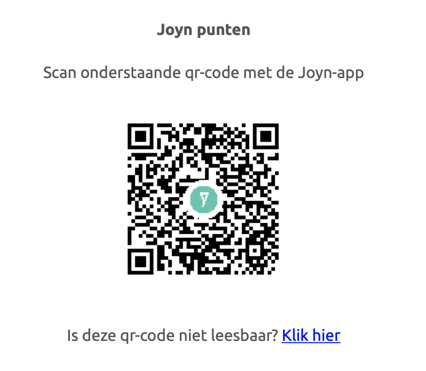

#Laravel Joyn API Package

[](https://packagist.org/packages/bulldots-bulletpoint/laravel-joyn)
[](https://packagist.org/packages/bulldots-bulletpoint/laravel-joyn)

Laravel Joyn API Package.

Generate a Joyn QR code that the user can scan after buying products from the shop.

## Installation

You can install the package via composer:

```bash
composer require bulldots-bulletpoint/laravel-joyn
```

## Usage

###Example: 

 A user buys something from your webshop.
 After the payment is done an email is send to the user to verify that the order is payed.
 
 You can add the joyn qr code to that email.
 Example:
 
 Here we add the code in the webhookController 

            //Http/Controllers/Front/webhookController.php
            ...
 
            $joyn = new JoynController();
            $auth = $joyn->getAuthorization();
            $result = $joyn->setLoyaltyToken($auth,$order->reference,$payment->paymentData['amount']);

            Mail::send("emails.orderConfirmation", [
                "order"  => $order,
                "joyn"   => $result,
                "status" => "Your order is payed and confirmed."
            ]);
 
            ...
  
 And then you edit the OrderConfirmation mail template:

        //resources/views/emails/orderConfirmation.blade.php
        ...

        <p>Joyn points</p>
        <p>Scan QR-Code below with the Joyn-app</p>
        
        <p>Can't read the QR-Code? <a href="{{$joyn['tokenUrl']}}">Click here</a></p>
        
        ...



### Changelog

Please see [CHANGELOG](CHANGELOG.md) for more information what has changed recently.

### Security

If you discover any security related issues, please email louise@bulldots.be or olivier@bulldots.be instead of using the issue tracker.

## Credits

-   [Louise Schotte](https://github.com/schottelouise)
-   [Olivier Van de Velde](https://github.com/vdvcoder)

## License

The MIT License (MIT). Please see [License File](LICENSE.md) for more information.

## Joyn - Public API documentation

[https://developer.joyn.be](https://developer.joyn.be/)
